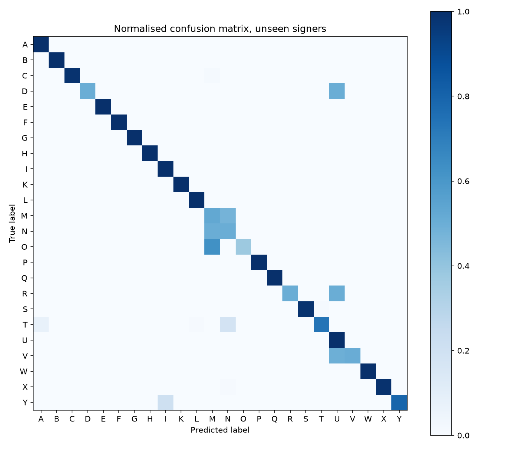

# ASL Alphabet Recognition

Real-time recognition of the American Sign Language alphabet from a webcam,
using MediaPipe hand landmarks and a small classifier.


## What it does

Classifies a single webcam frame into one of the **24 static ASL letters**. `J`
and `Z` are excluded: both are traced in the air, so no single frame holds them.

## How it works

```
                     ┌──────────────────┐     ┌────────────┐
  image / webcam ──> │    MediaPipe     │ ──> │ normalised │ ──> MLP ──> letter
      frame          │ Hand Landmarker  │     │  features  │
                     └──────────────────┘     └────────────┘
                       21 × (x, y, z)            60 values
                          (frozen)                (shared)
```

MediaPipe is used as a frozen feature extractor. Each hand becomes 21 landmarks,
turned into a 60-value vector by re-centring on the wrist, dividing by the
wrist → middle-finger-MCP distance, and correcting for the frame's aspect ratio.
Only the classifier is trained: an MLP of (256, 128) units on ~14k samples.

A single function performs those three steps, for the offline extraction and for
the live demo alike, so the features the model learns on and the features it is
given at inference cannot drift apart.

## Results

MediaPipe finds a hand in **99.9%** of the 36,000 images.

Six signers train, two validate, two test — nobody appears in two splits.

| split | macro F1 | accuracy |
| --- | --- | --- |
| **unseen signers** | **0.856** | 0.850 |
| random | 1.000 | 1.000 |

The random split is reported for comparison only: each signer photographed every
letter 100 times, so near-duplicate frames land on both sides of it.

Classification adds 0.2 ms per frame; MediaPipe's detection dominates at about
16 ms, so on a laptop CPU the demo runs at the camera's frame rate.



Errors concentrate on the fist family, where the thumb is the only discriminator
and the most occluded landmark: `M` (F1 0.39) and `N` (0.46) are the worst, and
the live demo reads `N` as `T`. The index-and-middle group follows — `U` (0.57),
`D`, `R` and `V` (0.67).

## Limitations

- **A single split**, with two held-out signers, so the headline figure comes
  with no measured spread.
- **Fist family.** `M`, `N` and `T` differ only by thumb placement, which
  MediaPipe has to infer when the thumb is hidden behind the fingers.
- **Ten volunteers in one place.** The landmarks discard skin tone, lighting and
  background, but not signing style: a quirk shared by everyone who learned the
  alphabet from the same reference would be invisible in this data.
- **Static letters only.** `J` and `Z` need a model that reads a sequence of
  frames rather than one.
- **The confidence shown by the demo is an uncalibrated softmax score**, not a
  probability: random landmarks still score close to 1.0. It ranks poses well
  enough to threshold on, which is all it is used for.

## Dataset

[ASL-HG](https://data.mendeley.com/datasets/j4y5w2c8w9/1) — 36,000 images of
300×300 pixels, 36 classes, 10 signers, CC BY 4.0. This project uses the 24
static letters: 24,000 images, 23,980 of which yield a hand.

> Pranto, M. F. I., Islam, M. R., Akbor, M. A., Ghosh, N., Alam, M. R.,
> Chaki, S., & Islam, M. M. (2025). *ASL-HG: American Sign Language Hand
> Gesture Image Dataset*. Mendeley Data, V1.
> https://doi.org/10.17632/j4y5w2c8w9.1

## Installation

Requires Python 3.14.

```bash
python -m venv venv
venv\Scripts\activate
pip install -r requirements.txt
```

MediaPipe weights are downloaded on first run. The dataset is downloaded
manually from the link above and unzipped into `data/raw/asl_hg/`.

## Usage

```bash
python -m src.build_dataset --input-dir data/raw/asl_hg   # images -> landmarks.csv
python -m src.train                                       # -> classifier + reports
python -m src.demo_webcam                                 # live demo, q to quit
```

## Layout

```
src/
├── config.py           paths, dataset constants, CSV schema
├── landmarks.py        MediaPipe wrapper: image -> 21 landmarks
├── features.py         landmarks -> normalised feature vector (shared)
├── build_dataset.py    images -> data/processed/landmarks.csv
├── train.py            landmarks.csv -> classifier + reports/
└── demo_webcam.py      real-time webcam demo
```

`reports/` is tracked so the metrics stay readable without cloning the dataset;
`data/` and model binaries are not.

## Roadmap

- [ ] Leave-one-signer-out cross-validation, for a spread over all ten signers
- [ ] Extra features for the closed-fist letters: the distances from the thumb
      tip to each fingertip, which is what separates `M`, `N` and `T`
- [ ] Temporal model for `J` and `Z`
